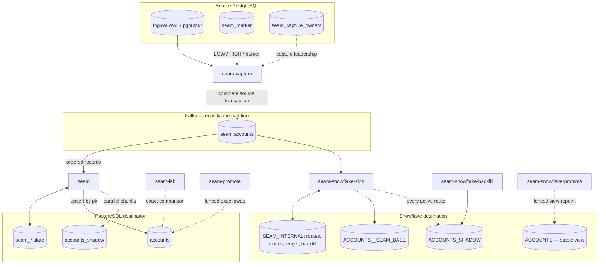

# SEAM

SEAM is a PostgreSQL change data capture and online backfill system. It reads
committed PostgreSQL transactions, carries them through Kafka, and maintains a
PostgreSQL or Snowflake destination while historical rows are copied in
parallel underneath live traffic.



The project focuses on correctness during concurrency and failure. It is not a
general connector platform. The goal is a smaller system whose transaction
boundaries, recovery rules, and limitations can be explained and tested
precisely — and then tested against a real PostgreSQL, a real Kafka, and a real
Snowflake account.

## Why this project exists

A normal table copy becomes unsafe the moment the source is still receiving
writes. A snapshot can read an old row, CDC can apply a newer update, and the
delayed snapshot then overwrites that update. A deleted row can also be
reinserted by a snapshot that read it before the delete.

The same hazard appears in a moving target of a different kind. Online schema
work means building a new physical table while the current one keeps serving
reads and writes. If the rebuild cannot prove that the table it is about to
promote equals the source at a known point in the change stream, the promotion
is a guess.

SEAM treats both problems as the same problem: **a bulk copy is only safe if
every change that raced with it can be identified afterwards.** It surrounds
every snapshot chunk with `LOW` and `HIGH` marker transactions written into the
source database, so the markers travel through the same ordered Kafka partition
as the row changes they are protecting. Any key changed between `LOW` and `HIGH`
is evicted from that chunk's snapshot candidates. Live CDC therefore always
wins over stale snapshot data, and the destination is provably correct without
pausing the source.

## System flow

```text
PostgreSQL WAL
      |
      v
seam capture                    one committed source transaction
      |                         -> one envelope, or ordered
      v                          bounded fragments
Kafka (exactly 1 partition)
      |
      +-----------------------------+
      |                             |
      v                             v
PostgreSQL destination        Snowflake destination
      |                             |
      v                             v
physical table, renamed      stable view over a physical table
at promotion
```

Capture, the reconciler, and promotion are separate long-running processes. That
separation is deliberate: capture must keep acknowledging WAL no matter what a
backfill is doing, and a backfill crash must never be able to stall the stream.

### How a source transaction becomes a wire message

Capture uses `pgoutput` protocol version 1 against a logical replication slot.
A committed source transaction is published as one envelope:

```json
{
  "Version": 2,
  "Source": {"Generation": "gen:0", "SystemID": "7031...", "XID": 741, "LSN": "0/16B6A30"},
  "SchemaID": "fingerprint-of-the-source-descriptor",
  "FragmentIndex": 0,
  "Final": true,
  "Count": 2,
  "TotalCount": 2,
  "Changes": [
    {"Op": "insert", "SchemaID": "...", "Row": {"Values": [{"Kind": 1, "Int": 1}, {"Kind": 2, "Text": "ada"}]}},
    {"Op": "update", "SchemaID": "...", "Row": {"Values": []}}
  ]
}
```

Values travel as PostgreSQL's own canonical text (`col::text` under
`SET TIME ZONE 'UTC'`), so integers arrive as `int64` and everything else as
text. Capture pins the session timezone to UTC precisely so that a replayed
transaction decodes byte-identically every time.

Bounded fragments exist because a Kafka record cannot be arbitrarily large. An
open transaction is held in memory up to **800 KiB**; past that it spills to a
temporary file and is streamed, and the published records are bounded below
**900 KiB**. Fragments of one transaction share a `Source` and are ordered by
`FragmentIndex`, and only the fragment with `Final = true` releases the
transaction to a consumer. Until then the transaction is invisible and
uncheckpointed — a consumer can never observe half a source transaction.
Abandoned fragment prefixes from a crashed publisher are discarded when the
retry's fragment 0 arrives, and fragment offsets must be contiguous.

The record key is `systemid:generation:commit-lsn`. Ordering is global rather
than per key, because the topic is required to have exactly one partition;
capture pins the topic's identity (id plus partition count) and refuses to run
against a recreated topic under the same name.

## The correctness rules

1. **PostgreSQL is acknowledged only after Kafka acknowledges every fragment of
   the transaction.** Capture sends its standby status with `WALWritePosition`,
   `WALFlushPosition`, and `WALApplyPosition` all set to the transaction's
   `EndLSN`, and it does so only after a synchronous produce ack. A crash before
   that ack simply means PostgreSQL sends the transaction again. A decode or
   publish error returns before the ack, so unsupported WAL is re-sent after
   repair rather than skipped.

2. **Kafka offset and destination data commit together, in the destination.** The
   Kafka cursor is not a consumer-group offset; it is `next_kafka_offset` in the
   destination's own state. One source transaction is applied inside one
   destination transaction that also writes the applied-transaction ledger and
   advances that cursor, under a compare-and-set. There is no window in which
   data is committed but the frontier moved, or the frontier moved but data was
   not.

3. **Replay identity is the source commit LSN, not the Kafka offset.** A crash
   between the Kafka ack and the WAL feedback means the same source transaction
   is republished at a *different* Kafka offset. Deduplication is keyed on
   `(job_id, generation, source_lsn)`. A transaction already in the ledger is
   skipped entirely — including its marker state transitions — while still
   advancing the frontier, so a republish cannot produce new destination effects.
   On Snowflake the ledger additionally stores a deterministic content
   fingerprint, so a "replay" whose bytes differ is an error rather than a
   silent skip.

4. **Snapshot rows cannot overwrite a newer update or resurrect a delete.** This
   is the marker protocol, described in detail below. It is the invariant the
   whole backfill design exists to protect.

5. **Expired process and chunk owners are fenced after takeover.** A reconciler
   owns a leased, monotonic epoch; a worker owns a chunk lease token. Both are
   proven inside the destination transaction that performs the write, so a stale
   process fails instead of overwriting. Capture has the same property on the
   source side via a session advisory lock plus a durable owner epoch.

6. **Source impact is admitted, not assumed.** Source scans and destination
   transactions take shared PostgreSQL session advisory permits, so a live
   reconciler and a shadow rebuild draw from the same configured capacity, and a
   crashed owner's permits are released by the server.

7. **Promotion requires exact validation at a known stream boundary.** Both
   destinations promote only after comparing the candidate against the source
   at a specific Kafka prefix, and only the keys changed since that prefix are
   re-checked under a short source fence.

8. **Ambiguity stops the pipeline.** A replaced source cluster, a recreated
   Kafka topic, recycled WAL under the slot, schema drift, an unsupported
   `pgoutput` message, or an unverifiable manifest all stop capture or the
   reconciler rather than skipping data. SEAM would rather be down than quietly
   wrong.

## Backfill: how a live snapshot stays correct

### The LOW/HIGH marker protocol

For each primary-key chunk a worker does this:

1. **Write `LOW`.** A row is inserted into the source-side `seam_marker` table.
   That insert is its own committed source transaction, so `pgoutput` emits it
   and capture publishes it as an ordinary transaction envelope on the same
   partition as the data.
2. **Scan the chunk.** The worker reads the source range and stages candidates
   into durable destination state (`seam_candidates`).
3. **Write `HIGH`.** Another ordinary source transaction, ordered after every
   concurrent write.
4. **Apply CDC.** While the scan ran, the consumer kept applying live changes.
   Any change for a key inside the chunk marks that key's candidate `evicted`.
5. **Write survivors.** Only `evicted = false` rows reach the destination.

The consequence: a key touched anywhere between `LOW` and `HIGH` is *removed*
from the snapshot, and its correct value arrives from the live stream instead.
A delete is an eviction plus a tombstone, so it cannot be undone by the copy. A
snapshot row that arrives *after* an eviction does not resurrect it — the
staging upsert ORs the evicted flag (`evicted = existing OR new`) rather than
overwriting it.

Marker rows carry the job, an attempt id, the kind, and the inclusive chunk
range. The reconciler only reacts to a marker whose job, attempt, and range all
match the chunk it is currently reconciling, and the window state machine
rejects an unexpected `LOW` or `HIGH` rather than guessing. That is what makes
recovery safe: after an interrupted job bumps the attempt, every marker and
every candidate row from the previous attempt becomes unreachable.

### The chunk manifest is sealed, not assumed

Chunk discovery converts sparse key pages into **dense logical ranges** and
commits each range together with the discovery cursor, so a crash can never
produce a half-written manifest. The manifest is only believed to be complete
when it is *proved* gap-free: it must start at the minimum `BIGINT`, every
range must begin exactly one after the previous range ends, and the last range
must end exactly at the captured upper bound. Completeness is never inferred
from an empty lease queue — that is precisely the state a crashed discovery
leaves behind.

### Parallel workers, without parallel commit

The coordinator is the only Kafka consumer and the only writer of the frontier,
because one partition means one offset owner and one checkpoint row. Workers
lease disjoint chunks from the sealed manifest and write their own `LOW`/`HIGH`
markers on the source, so the expensive part — scanning — is parallel while
commit ordering stays serialized. The backfill frontier advances only across a
contiguous prefix of the manifest, so out-of-order completions never move it
past a gap.

A worker is fenced three ways, and all three must hold: its chunk lease is a
compare-and-set on `worker_id` plus a bumped `lease_token`; the attempt id must
still be the active one; and the process epoch must still be leased. A worker
that lost its lease rolls back rather than publishing progress.

## PostgreSQL destination

### Destination state

All pipeline state lives in the destination database, created by
`checkpoint.EnsureTables` on boot:

| Table | Purpose |
|---|---|
| `seam_jobs` | Immutable per-job identity: source `system_identifier`, slot, publication, a hash of the source DSN, Kafka topic id, generation, captured upper bound, durable source schema descriptor and fingerprint, discovery cursor, discovery-complete flag |
| `seam_checkpoints` | Exactly one row per job: attempt, owner id / owner epoch / lease expiry, scan upper bound, `completed_through_id`, `next_kafka_offset`, `last_applied_lsn` |
| `seam_applied_txs` | The exactly-once ledger, keyed `(job_id, generation, source_lsn)`; never pruned |
| `seam_chunks` | Sealed manifest plus per-chunk lease: status, worker, `lease_token`, expiry, `high_offset` / `high_lsn`, row counters. Primary key includes `attempt` |
| `seam_candidates` | Durable per-chunk snapshot staging: one row per key, canonical-text `payload`, `evicted` tombstone flag, partial index over survivors |
| `seam_route_fence` | The single shared routing lock; writers take it `FOR SHARE`, promotion takes it exclusively |
| `seam_cutover_gates` | Exact-prefix cutover stop signal read by the reconciler |
| `seam_promotions` | Promotion bookkeeping: which live job a shadow replaced, at which barrier offset, and the retired table name |

Two more tables live on the **source** side, created on demand: `seam_marker`
(the marker protocol) and `seam_capture_owners` (capture leadership).

### Chunk lifecycle

```text
pending -> leased -> scanning -> reconciling -> committing -> completed
```

Every transition is committed durably. `committing` and `completed` are written
in the *same* transaction as the survivors, the applied-transaction marker, and
the checkpoint advance, so a crash before commit leaves the chunk in
`reconciling` to be retried under a fresh attempt rather than half-applied.

### Exactly-once application

Within one destination transaction the reconciler checks the ledger, applies
row changes as upsert-by-primary-key or delete-by-key, writes eviction
tombstones, marks the transaction applied, and compare-and-sets the Kafka
frontier. Rows are applied with `INSERT ... ON CONFLICT (pk) DO UPDATE`, and
deletes are `DELETE ... WHERE pk = ANY(...)`, so a replayed transaction is also
idempotent at the row level even if the ledger were bypassed.

A fragmented transaction is walked twice — once to evaluate markers, once to
apply — with each pass bounded to one fragment's worth of changes and backed by
a temporary file rather than heap. Every record in a streamed transaction
reports the transaction's *final* offset, so the frontier can only advance past
the whole transaction once that transaction commits.

### Leadership, admission, recovery

- **Process leadership** is a leased monotonic epoch on `seam_checkpoints`.
  Acquisition only succeeds when the lease is expired or absent; renewal
  requires the same owner, epoch, and unexpired lease — so an expired lease
  cannot be resurrected even with no contender. The epoch is proven `FOR SHARE`
  inside every destination transaction, and the first renewal failure cancels
  the process.
- **Capture leadership** is a session advisory lock on the slot plus a durable
  `seam_capture_owners` row whose `owner_epoch` only increases. A takeover must
  preserve the source system id, generation, publication, and Kafka topic id
  recorded for that slot; changing any of them is refused rather than silently
  continuing against a different source.
- **Load admission** uses PostgreSQL session advisory locks — a shared permit
  pool for source scans and one for destination transactions, in a fixed key
  namespace. Because they are session locks, a crashed process's permits are
  reclaimed by the server. A scan also re-checks CDC lag before and after
  waiting, so a backlogged stream throttles the backfill instead of starving it.
- **Recovery** re-derives and compares the source schema fingerprint, verifies
  the replication slot still exists, checks the durable frontier against Kafka's
  earliest retained offset, finishes any interrupted discovery, and only then
  starts a new attempt for unfinished chunks. The frontier is deliberately *not*
  rewound — replay from the last durable offset is made a no-op by the ledger
  and the upsert path.

### Online rebuild and promotion

For an online rebuild, the live job keeps maintaining the public table while a
second job fills a shadow table. Promotion then:

1. verifies job, source, and topic identity, plus table schema, ownership, and
   grants;
2. drains both jobs to one exact Kafka prefix using the cutover gates;
3. takes a short `SHARE` fence on the source, emits a validation barrier, and
   establishes a repeatable-read source snapshot at exactly that prefix;
4. releases writes and **merge-compares** the full source snapshot against the
   shadow — comparing rows, not counts;
5. re-fences, emits a cutover barrier, and compares **only the keys changed
   since the validated snapshot**, bounded by `--max-delta-keys` (default
   100,000, which aborts rather than growing unbounded);
6. takes the exclusive routing fence plus destination locks, briefly takes
   `ACCESS EXCLUSIVE`, rechecks schema and both frontiers, deactivates the shadow
   writer, renames `accounts` to `accounts_retired_<timestamp>` and
   `accounts_shadow` to `accounts`, and records the promotion — **all in one
   destination transaction**.

The previous live table is retained, not dropped. Retrying the same promotion
detects the committed swap and reports the retained table rather than switching
the old generation back.

## Snowflake destination

The Snowflake path is a separate set of processes against the same capture
stream: `seam-snowflake-sink` (the only CDC writer), `seam-snowflake-backfill`
(one shadow generation), and `seam-snowflake-promote` (validate, then promote).
The sink must keep running through backfill, validation, and promotion.

### Layout

The public name is a **view**. The first writable generation is a physical
table (e.g. `ACCOUNTS__SEAM_BASE`); a backfill builds a separate shadow table
(e.g. `ACCOUNTS_SHADOW`); promotion is an idempotent `CREATE OR REPLACE VIEW`
over the validated shadow. All metadata lives in an internal schema: `OFFSETS`
(authoritative frontier + pinned topic id), `SINK_LEASES`, `APPLIED_TRANSACTIONS`
(source identity + content fingerprint), `ROUTES` (which physical tables
receive live CDC), `KEY_CLOCKS` (per-route, per-key source clock including
delete tombstones), `CDC_STAGE`, `MARKERS`, `BACKFILL_JOBS`, `BACKFILL_CHUNKS`,
`BACKFILL_FILES`, `SNAPSHOT_STAGE`, and a named internal stage.

### One Snowflake apply transaction

Each complete source transaction is applied inside a single Snowflake
transaction that contains, in order: the row-effect `MERGE` against every
active physical route, the per-key source-clock `MERGE` (where the ordering key
is the pair *commit LSN, intra-transaction sequence*), the durable replay
ledger insert, a compare-and-set advance of the frontier, and the cleanup of the
staging rows. A delete is a tombstone *in the key clock*, not a row in the
target, so a stale backfill candidate cannot resurrect a deleted key.

Immediately before committing the ledger and frontier, the transaction
re-proves its own sink lease — on the same connection, as a statement inside the
transaction. A takeover that has already bumped the epoch causes the proof to
fail and the entire transaction to roll back, including all data effects. One
sink owns a stream at a time under a renewable lease with a monotonic epoch;
ambiguous failures are classified from the durable ledger on retry.

Shadow routes are **activated before the source upper bound is sampled**, which
closes the race where a row inserted above a prematurely-low upper bound would
miss the backfill entirely. Retired routes are deactivated, never deleted, and
the old physical tables are kept; because the promoted route keeps its id and
only its target changes, its per-key clocks carry across generations and
continue to gate both CDC and backfill merges.

### Snowflake backfill and validation

The shadow is filled with the same `LOW`/`HIGH` protocol: a worker leases a
chunk with a fencing token, writes `LOW`, clears the chunk's disposable staging,
scans the source, uploads and reloads candidates, writes `HIGH`, **waits until
the sink has durably applied `HIGH`**, then finalizes. Finalization merges a
candidate only when that key's CDC clock is absent or at-or-before `LOW` — a
newer clock means CDC already has the truth, including a delete tombstone.
Because the sink applies markers in order, observing `HIGH` in Snowflake proves
every racing change's clock exists.

Candidate loading defaults to a bulk path: one deterministic gzip JSON-lines
file per chunk (byte-identical output for identical input, so retries regenerate
the same content-addressed file id), `PUT` to the internal stage, and a
`COPY INTO ... FORCE = TRUE` that deletes, reloads, and verifies the exact row
count under the chunk's lease token — all in one transaction. A parameterized
SQL batching path remains available as a diagnostic control.

Validation fences the source only long enough to export a repeatable-read
snapshot, wait for a barrier marker to reach Snowflake, and zero-copy clone the
shadow at that exact marker; a second PostgreSQL transaction imports the
exported snapshot before the fence is released. The full range-by-range
comparison then runs **after writes resume**, using per-type normalization
(timestamps through UTC, JSON through canonicalized `jsonb`) so PostgreSQL and
Snowflake values are compared as text rather than as native types.

Promotion replays the Kafka suffix after the validation marker into a bounded
changed-key set, re-fences, compares only those keys against the still-live
shadow, then repoints the view. Because the promotion intent is recorded before
the view DDL and both routes stay active across it, a crash mid-swap is repaired
by simply repeating the same idempotent view assignment.

### Retry and type mapping

Snowflake retries cover transient service and network conditions only
(`08`/`40`/`53`/`57`/`58` SQL states and specific service errors); SQL, schema,
and data errors fail immediately rather than being retried. The PostgreSQL and
Kafka paths retry their own transient classes with bounded geometric backoff.
The Snowflake type mapping is a deliberately small, *provable* set — integers,
boolean, char/text/varchar/uuid, date, timestamp, timestamptz, and jsonb —
anything else stops startup rather than being cast and hoped for.

## Correctness boundaries

SEAM supports one source table per pipeline, one Kafka partition, and one
immutable `BIGINT` primary key. The source table must use
`REPLICA IDENTITY FULL` so full old images are available for updates and
deletes, and live in `public`. Every generation pins the source cluster, Kafka
topic, table schema, and supported type mapping.

The system stops when it sees a replaced source cluster, a recreated Kafka
topic, missing retained history, schema drift, an unsupported operation, or an
ambiguous state it cannot prove safe. It does not silently skip data.

The main guarantees are:

1. A source transaction is not partially exposed at the destination.
2. Destination changes and the Kafka frontier commit together.
3. Replayed source transactions do not create new destination effects.
4. Snapshot rows cannot overwrite a newer update or resurrect a delete.
5. Expired process and worker owners are fenced after takeover.
6. Promotion requires exact validation at a known stream boundary.
7. Bulk rebuilds and live traffic share one configured load budget.

## Run it

### PostgreSQL → Kafka → PostgreSQL

The repository ships a small local stack (source, destination, Kafka,
zookeeper, and a capture service). From this directory:

```bash
docker compose up -d
```

Wait until capture has created its logical slot and Kafka topic, then start the
destination job:

```bash
SEAM_JOB_ID=live go run ./cmd/seam --start-fresh
```

`--start-fresh` reserves the destination table for one active job, writes a
source barrier, waits for that barrier's complete transaction on Kafka, and
persists the job's start offset together with the pinned source and topic
identities and a durable chunk manifest. The public table is queryable while
this runs, but is incomplete until the checkpoint reaches the captured upper
bound and CDC has caught up.

Restart an interrupted job with the same configuration **without**
`--start-fresh`; it resumes from durable state.

For an online rebuild, run a second job against an empty shadow table and then
promote it:

```bash
SEAM_JOB_ID=shadow-1 SEAM_DEST_TABLE=accounts_shadow go run ./cmd/seam --start-fresh
go run ./cmd/seam-promote --live-job live --shadow-job shadow-1 --timeout 10m
```

### PostgreSQL → Kafka → Snowflake

```bash
go run ./cmd/seam-capture                 # leave running
go run ./cmd/seam-snowflake-sink          # the only Snowflake CDC writer; leave running

SEAM_BACKFILL_JOB_ID=backfill-1 \
SEAM_BACKFILL_ATTEMPT=attempt-1 \
SNOWFLAKE_SHADOW_TABLE=ACCOUNTS_SHADOW \
go run ./cmd/seam-snowflake-backfill     # exits at ready_to_verify

go run ./cmd/seam-snowflake-promote validate
go run ./cmd/seam-snowflake-promote promote
```

## Configuration

Every connection setting and knob is an environment variable; no secret belongs
on a command line. `cmd/seam` (the PostgreSQL reconciler) reads:

| Variable | Default | Purpose |
|---|---|---|
| `SEAM_JOB_ID` | `seam-default` | Destination metadata job identity |
| `SOURCE_SQL_DSN` | local source on `:5433` | Source SQL connection |
| `SOURCE_REPLICATION_DSN` | source DSN + replication | Source replication-protocol connection |
| `SEAM_SOURCE_SLOT` | `seam_slot` | Logical replication slot name |
| `SEAM_SOURCE_PUBLICATION` | `seam_pub` | Source publication name |
| `SEAM_SOURCE_TABLE` | `accounts` | Source table in `public` |
| `SEAM_SOURCE_KEY` | *(schema PK)* | Explicit primary-key column, if not the loaded schema's |
| `DEST_SQL_DSN` | local dest on `:5434` | Destination SQL connection |
| `SEAM_DEST_TABLE` | `accounts` | Destination physical table |
| `KAFKA_BROKERS` | `localhost:9092` | Kafka seed brokers |
| `KAFKA_TOPIC` | `seam.accounts` | Captured transaction topic |
| `SEAM_WORKER_ID` | `<hostname>-<unixnano>` | Worker identity for leadership |
| `SEAM_CHUNK_SIZE` | `1000` | Rows per chunk during discovery |
| `SEAM_LEASE_DURATION` | `30s` | Leadership and chunk lease duration |
| `SEAM_HEARTBEAT_INTERVAL` | lease / 3 | Leadership renewal cadence |
| `SEAM_WORKERS` | `1` | Reconciler worker count |
| `SEAM_MAX_IN_MEMORY_CANDIDATES` | `1000000` | Max candidate rows per source scan |
| `SEAM_MAX_CANDIDATE_BYTES` | `256 MiB` | Candidate byte budget (divided across workers) |
| `SEAM_MAX_RECORDS_PER_BATCH` | `100` | Kafka max poll records |
| `SEAM_MAX_SOURCE_SCANS` | `4` | Concurrent source scans (shared advisory permits) |
| `SEAM_MAX_DESTINATION_TX` | `8` | Concurrent destination transactions (shared advisory permits) |
| `SEAM_MAX_CDC_LAG_RECORDS` | `10000` | Backpressure threshold before scans block |
| `SEAM_RESOURCE_POLL_INTERVAL` | `1s` | Resource controller poll interval |
| `SEAM_HTTP_ADDR` | *(unset)* | If set, serves `/healthz`, `/metrics`, `/progress` |
| `SEAM_ADAPTIVE_CHUNKING` | `false` | **Rejected in production** — bypasses the durable manifest |

`SEAM_MAX_SOURCE_SCANS` and `SEAM_MAX_DESTINATION_TX` should be identical
across live and shadow processes so they genuinely share one budget.

The Snowflake processes add `SNOWFLAKE_DSN`, `SNOWFLAKE_DATABASE`,
`SNOWFLAKE_SCHEMA`, `SNOWFLAKE_INTERNAL_SCHEMA`, `SNOWFLAKE_LIVE_TABLE`, and
`SEAM_STREAM_ID`, plus per-command variables for sink lease duration, retry
budget and apply timeout, backfill chunk size / workers / leases, the snapshot
loader (`bulk` or `sql`), upload parallelism, and promotion limits
(`SEAM_MAX_WRITE_PAUSE`, `SEAM_SOURCE_LOCK_TIMEOUT`, `SEAM_MAX_DELTA_KEYS`).
Full tables are in [docs/snowflake.md](docs/snowflake.md).

## Verification

Go 1.27.1 is the tested local toolchain; `go.mod` declares `go 1.25.0` and CI
derives its Go version from that file. `go build`, `go vet`, and unit tests need
no services.

```bash
go test ./...
go test -race ./...
go build ./...
go vet ./...
```

The PostgreSQL and Kafka integration suite uses a dedicated destructive test
stack.

```bash
docker compose -f integration/docker-compose.yml up -d
make test-integration        # 21 integration tests + 2 promotion tests
```

The live Snowflake control-plane test creates temporary schemas and removes them
after the run.

```bash
SNOWFLAKE_DSN='...' SNOWFLAKE_DATABASE='...' make test-snowflake-live
```

The combined PostgreSQL, Kafka, and Snowflake crash-recovery scenario requires
both external systems:

```bash
make test-snowflake-e2e
```

It has passed with an exact 520-row match after a sink crash, lease takeover,
coordinator restart, parallel recovery, validation, promotion, and promotion
retry.

For a one-off exact comparison of a destination against the source, the
bundled verifier can fence the source, wait for a marker and the destination
frontier, and merge-compare every row:

```bash
SEAM_JOB_ID=live go run ./cmd/seam-lab verify-fenced
```

The `/metrics` endpoint exposes chunk completion, candidate, survivor, and CDC
counters, and `/progress` exposes the durable frontier, scan bound, and applied
LSN — the same numbers the `seam_checkpoints` row holds.

## Performance evidence

| Path | Workload | Result |
|---|---|---|
| PostgreSQL backfill | 100,000 rows, one worker | ~3,379 rows/s |
| PostgreSQL backfill | 100,000 rows, four workers | ~6,717 rows/s (~1.99x wall clock) |
| Snowflake snapshot (SQL loader) | 5,000 rows | ~188 rows/s |

The PostgreSQL samples are an exact verified local pair, not a distribution,
and are not evidence of performance at millions or billions of rows.

The original Snowflake snapshot path reached ~188 rows/s at 5,000 rows because
it issued parameterized SQL batches. SEAM now writes one deterministic
compressed JSON file per leased chunk, uploads it to an internal Snowflake
stage, and reloads the disposable candidate table with `COPY INTO`. The SQL and
bulk paths can be compared with the same component benchmark. No post-change
live result is recorded yet, so the repository does not claim a speedup from
the new path without measurement.

Raw results and measurement boundaries are recorded in
[docs/benchmarks.md](docs/benchmarks.md).

## Current limitations

One Kafka partition, one table per pipeline, and no online schema evolution.
`TRUNCATE`, primary-key changes, and unsupported `pgoutput` messages stop the
pipeline rather than being partially handled. Adaptive chunking is disabled
because it would bypass the durable manifest. Snowflake snapshot chunks use a
bulk file loader, but CDC transactions still use bounded SQL staging and
set-based merges, and the internal stage retains uploaded files — including
orphans from fenced workers — until a proven garbage collector exists. The
bundled Kafka stack is a development fixture and makes no production
availability claim. Large-scale source impact, warehouse cost, and bulk-loader
throughput have not been measured.

These limits are intentional. SEAM prioritizes transaction correctness,
recovery, fencing, exact validation, and honest evidence over connector count.

## Documentation

Start with [the system ownership report](docs/SEAM-system-ownership-report.md)
for a full explanation from first principles.

Use [the PostgreSQL operations guide](docs/operations.md) and
[the Snowflake operations guide](docs/snowflake.md) to run each destination
path.

Detailed benchmark evidence is in [docs/benchmarks.md](docs/benchmarks.md), and
the generic row / schema-epoch design argument is in
[docs/generic-row-design.md](docs/generic-row-design.md). The earlier
PostgreSQL engineering report is in
[docs/SEAM-engineering-report.md](docs/SEAM-engineering-report.md).